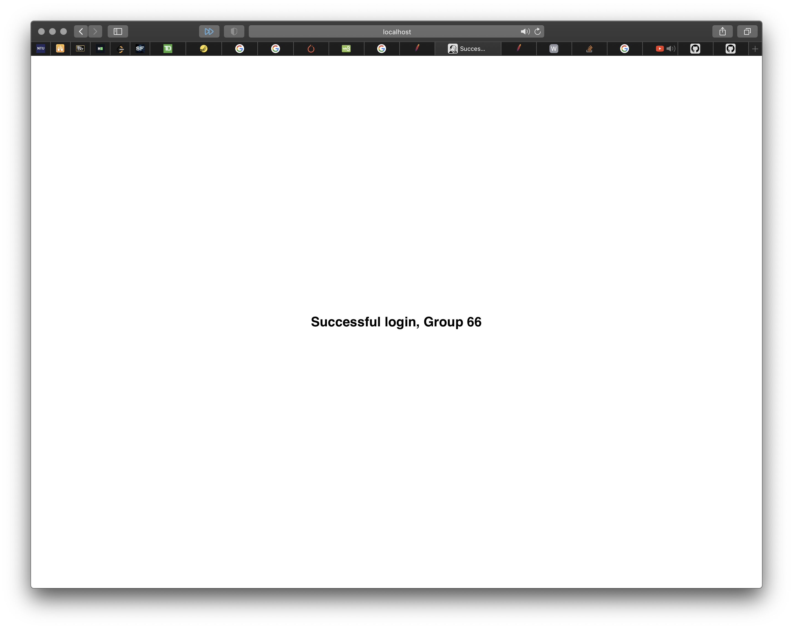
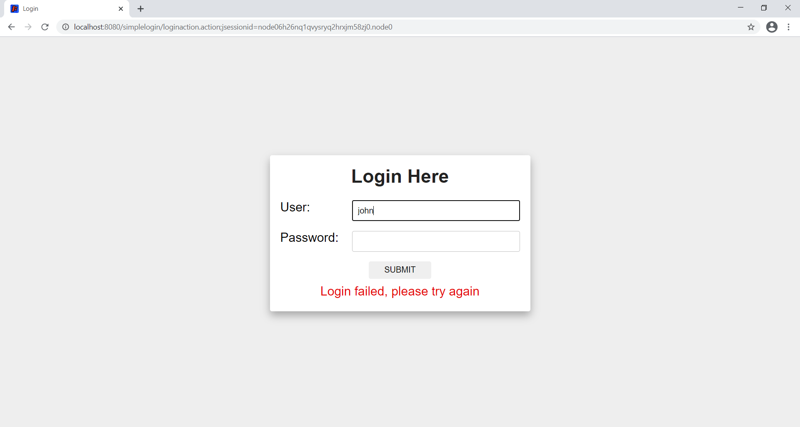

# Account-Login-Webapp-with-Struts
A web application for account login built with Struts.

## NTU CZ3002 Advanced Software Engineering - Group 66
This project is jointly developed by the following members.
* [Sheng Rong](https://github.com/TanShengRong)
* [Chen Ping](https://github.com/c-ping)
* [Kai Jie](https://github.com/Teo-KJ)

## Run locally

### Install Maven and JDK before execution
* Download [JDK](https://www.oracle.com/java/technologies/javase-jdk15-downloads.html)
* Follow the [steps](https://stackoverflow.com/questions/2619584/how-to-set-java-home-on-windows-7) here and set JDK to correct path for Maven to run.
* Download [Maven](https://apachemirror.sg.wuchna.com/maven/maven-3/3.6.3/binaries/apache-maven-3.6.3-bin.tar.gz)

### Maven
From the root directory:

`set PATH="c:\program files\apache-maven-3.6.3\bin";%PATH%`

Followed by:

`mvn jetty:run`

> Web app will be up @ [http://localhost:8080/simplelogin/index.action](http://localhost:8080/simplelogin/index.action)

### MySQL

My MYSQL database has the username "root" and "Ase123456" password

`mysql -uroot -pAse123456`

> To do any mysql queries in terminal

```mysql
CREATE TABLE `ase_assignment2`.`useraccounts` (
   `user` VARCHAR( 10 ) NOT NULL ,
   `password` VARCHAR( 10 ) NOT NULL ,
   `name` VARCHAR( 20 ) NOT NULL ,
   PRIMARY KEY ( `user` )
) ENGINE = InnoDB;
```

> Create inital table, can vary the maximum length :)

> (no longer needed to manually create table into MySQL)

```mysql
INSERT INTO `ase_assignment2`.`useraccounts` (`user`, `password`, `name`)
VALUES ('admin', 'password', 'Group 66');
```

> Create ase admin credentials (no longer needed to manually insert admin credentials into MySQL)

## Images

### Login Page


### Login Success



### Login Failure
User is to retry login



